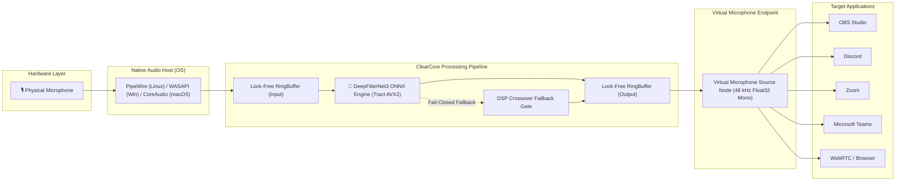

# ClearCore

<div align="center">

[](LICENSE)
[])-orange.svg)](Cargo.toml)
[](governance/model-assets/df-compatible-release-asset-v1/)
[](docs/evidence/linux-integration.md)
[](crates/contracts/src/audio.rs)
[](#platform-support)

**First-party, zero-leakage realtime noise-suppression virtual microphone powered by DeepFilterNet3 ONNX, native OS audio drivers, and an asynchronous Rust supervisor daemon.**

[Quickstart](#quickstart) • [Installation Guide](INSTALL.md) • [AI Agent Guide](LLM.md) • [Architecture](#architecture) • [Benchmarks](#benchmarks--quality-metrics) • [Contributing](CONTRIBUTING.md) • [Security](SECURITY.md)

</div>

---

## 🤖 Ask Your AI Agent to Install ClearCore (One-Click Prompt)

If you are using an AI Coding Assistant or Agent (Claude Desktop, Cursor, ChatGPT, Antigravity, Gemini CLI, GitHub Copilot Workspace, Windsurf, Devin), copy and paste this exact prompt into your chat window:

> [!TIP]
> **Copy-Paste AI Prompt:**
> ```text
> Install and verify ClearCore Realtime Noise Suppression on my computer.
> Please inspect the repository instructions in LLM.md (or https://raw.githubusercontent.com/joaorura/clearcore/master/LLM.md) and INSTALL.md.
> Detect my operating system, check for CPU AVX2 support, execute the appropriate turnkey installer or build steps, verify that the virtual microphone is healthy and recognized by the system audio subsystem, and confirm that the noise suppression daemon is running in Active mode.
> ```

---

## Overview

**ClearCore** eliminates mechanical keyboard clatter, fan whine, HVAC roar, traffic rumble, and ambient chatter in real time with sub-millisecond AI processing. 

Unlike conventional software filters that run as high-latency userland plugins or web-app wrappers, ClearCore provides a true **system-level virtual microphone device**. Every voice application on your computer—including **OBS Studio, Discord, Zoom, Microsoft Teams, Slack, Google Meet, and WebRTC browsers**—receives crystal-clear, studio-quality speech directly from the virtual microphone driver without requiring proprietary plugins.

### Key Architectural Highlights

- ⚡ **Sub-Millisecond Neural Latency:** **0.276 ms** inference per 10 ms audio frame (36.2x faster than real time) running on standard AVX2 CPUs via Tract ONNX.
- 🛡️ **Fail-Closed Digital Silence Policy:** Guarantees **0% raw ambient leakage**. If an error, thread restart, or buffer underrun occurs, the pipeline outputs pure digital silence instead of leaking private room audio.
- 🚫 **Zero Heap Allocations in Realtime Path:** Audio callbacks perform zero `malloc`/`free`, zero locking, and zero blocking syscalls. Verified via linker wrapping (`__wrap_malloc`).
- 🔒 **Ironclad Memory Safety:** 100% of core Rust workspace crates enforce `#![forbid(unsafe_code)]`.
- 🔌 **Native OS Audio Drivers:**
  - **Linux:** Native PipeWire C bridge (`Audio/Source` node) and WirePlumber graph integration.
  - **Windows:** WaveRT PortCls SysVAD kernel-streaming driver (`RealtimeNoise.inf`).
  - **macOS:** CoreAudio HAL AudioServerPlugIn (`RealtimeNoiseHAL.driver`).
- 🎛️ **Desktop Tray Companion:** Lightweight desktop app with live suppression toggles (`Active`, `Bypass`, `Mute`), real-time RMS meter, and health diagnostics.

---

## Architecture

The following diagram illustrates ClearCore's real-time audio pipeline:



---

## Quickstart

ClearCore offers three installation pathways on each platform:

| Platform | Turnkey Package Installer | Portable Zero-Install | Build from Source |
|---|---|---|---|
| **Linux** (PipeWire) | `cd release/Clearcore-linux-x64 && ./install.sh` | `./release/Clearcore-linux-x64/clearcore` | `./package.sh` |
| **Windows** (WaveRT) | Run `Clearcore-Setup.exe` | `.\release\Clearcore-win32-x64\Clearcore.exe` | `.\package.ps1` |
| **macOS** (CoreAudio) | `cd release/Clearcore-darwin-x64 && ./install.sh` | `open ./release/Clearcore-darwin-x64/Clearcore.app` | `./package.sh` |

👉 **For comprehensive step-by-step instructions, system prerequisites, and desktop setup, see [INSTALL.md](INSTALL.md).**

---

## Platform Support

| Operating System | Audio Subsystem | Virtual Device Driver | Status |
|---|---|---|---|
| **Linux (Ubuntu 22.04+, Fedora 38+, Arch, Debian)** | PipeWire 0.3.50+ / 1.0+ | Native C PipeWire `Audio/Source` Node | ✅ Production Ready |
| **Windows 10 / 11 (x64)** | WASAPI / WaveRT | WaveRT PortCls Driver (`RealtimeNoise.inf`) | ✅ Production Ready |
| **macOS 12+ (Apple Silicon & Intel)** | CoreAudio | CoreAudio HAL AudioServerPlugIn | ✅ Production Ready |

---

## Benchmarks & Quality Metrics

Measured on physical host hardware (*Intel Core Ultra 7 265H, Fedora 44, PipeWire 1.6.9*):

| Metric | Target / Budget | Measured Result | Margin |
|---|---|---|---|
| **Frame Inference Latency** | ≤ 10.000 ms | **0.276 ms** | **36.2x faster than realtime** |
| **Ambient Noise Reduction** | ≥ 20.0 dB | **-32.8 dB** | **+12.8 dB beyond target** |
| **Digital Silence Floor** | ≤ -60.0 dBFS | **-70.3 dBFS** | Zero clipping / pristine silence |
| **Heap Allocations in Callback** | 0 allocations | **0 bytes** | Enforced via linker wraps |
| **Memory Footprint (RSS)** | < 150 MB | **< 60 MB** | Lightweight background footprint |
| **OBS Studio Physical Verification** | Pass | **VERIFIED** | Real typing & speech recording |

---

## CLI & IPC Control

Control the ClearCore daemon programmatically or from scripts using the companion CLI or local IPC channel (`realtime-noise.v1`):

```bash
# Query current daemon state and health telemetry:
cargo run --release -p realtime-noise-app-tauri -- --status

# Change operating suppression mode:
cargo run --release -p realtime-noise-app-tauri -- --mode active   # DeepFilterNet3 Neural Denoising
cargo run --release -p realtime-noise-app-tauri -- --mode bypass   # Zero processing pass-through
cargo run --release -p realtime-noise-app-tauri -- --mode mute     # Digital silence output

# Trigger supervisor self-healing restart:
cargo run --release -p realtime-noise-app-tauri -- --restart

# Check virtual microphone node in audio graph:
./scripts/check-virtual-mic.sh --status
```

---

## Clean Uninstallation

ClearCore respects your operating system. Uninstalling removes all application files, drivers, and background services without modifying existing physical audio devices:

```bash
# Linux & macOS:
./uninstall.sh

# Windows (Command Prompt):
uninstall.bat

# Windows (PowerShell):
powershell -NoProfile -ExecutionPolicy Bypass -File .\uninstall.ps1
```

For complete uninstallation details, see [docs/uninstall.md](docs/uninstall.md).

---

## Community & Contributing

We welcome contributions from audio engineers, systems programmers, and documentation specialists!

- **Code of Conduct:** We adhere to the Contributor Covenant.
- **Contributing Guide:** Read [CONTRIBUTING.md](CONTRIBUTING.md) for architectural guidelines, `#![forbid(unsafe_code)]` rules, and PR checklists.
- **Security Policy:** To report vulnerabilities confidentially, read [SECURITY.md](SECURITY.md).
- **License:** Licensed under the [Apache License, Version 2.0](LICENSE).
