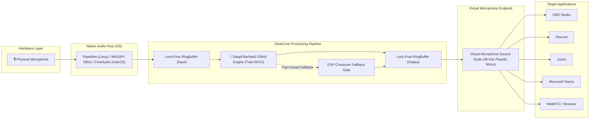

# ClearCore

<div align="center">

[](LICENSE)
[](LICENSE-MODELS)
[])-orange.svg)](Cargo.toml)
[](governance/model-assets/df-compatible-release-asset-v1/)
[](docs/evidence/linux-integration.md)
[](crates/contracts/src/audio.rs)
[](#platform-support)

**First-party, zero-leakage realtime noise-suppression virtual microphone powered by DeepFilterNet3 ONNX, native OS audio drivers, and an asynchronous Rust supervisor daemon.**

[Quickstart](#quickstart) • [Installation Guide](INSTALL.md) • [AI Agent Guide](LLM.md) • [Architecture](#architecture) • [Benchmarks](#benchmarks--quality-metrics) • [Contributing](CONTRIBUTING.md) • [Security](SECURITY.md)

</div>

---

## 🤖 Ask Your AI Agent to Install ClearCore (One-Click Prompt)

If you are using an AI Coding Assistant or Agent (Claude Desktop, Cursor, ChatGPT, Antigravity, Gemini CLI, GitHub Copilot Workspace, Windsurf, Devin), copy and paste this exact prompt into your chat window:

> [!TIP]
> **Copy-Paste AI Prompt:**
> ```text
> Install and verify ClearCore Realtime Noise Suppression on my computer.
> Please inspect the repository instructions in LLM.md (or https://raw.githubusercontent.com/joaorura/clearcore/master/LLM.md) and INSTALL.md.
> Detect my operating system, check for CPU AVX2 support, execute the appropriate turnkey installer or build steps, verify that the virtual microphone is healthy and recognized by the system audio subsystem, and confirm that the noise suppression daemon is running in Active mode.
> ```

---

## Overview

**ClearCore** eliminates mechanical keyboard clatter, fan whine, HVAC roar, traffic rumble, and ambient chatter in real time with sub-millisecond AI processing. 

Unlike conventional software filters that run as high-latency userland plugins or web-app wrappers, ClearCore provides a true **system-level virtual microphone device**. Every voice application on your computer—including **OBS Studio, Discord, Zoom, Microsoft Teams, Slack, Google Meet, and WebRTC browsers**—receives crystal-clear, studio-quality speech directly from the virtual microphone driver without requiring proprietary plugins.

### Key Architectural Highlights

- ⚡ **Sub-Millisecond Neural Latency:** **0.276 ms** inference per 10 ms audio frame (36.2x faster than real time) running on standard AVX2 CPUs via Tract ONNX.
- 🛡️ **Fail-Closed Digital Silence Policy:** Guarantees **0% raw ambient leakage**. If an error, thread restart, or buffer underrun occurs, the pipeline outputs pure digital silence instead of leaking private room audio.
- 🚫 **Zero Heap Allocations in Realtime Path:** Audio callbacks perform zero `malloc`/`free`, zero locking, and zero blocking syscalls. Verified via linker wrapping (`__wrap_malloc`).
- 🔒 **Ironclad Memory Safety:** 100% of core Rust workspace crates enforce `#![forbid(unsafe_code)]`.
- 🔌 **Native OS Audio Drivers:**
  - **Linux:** Native PipeWire C bridge (`Audio/Source` node) and WirePlumber graph integration.
  - **Windows:** WaveRT PortCls SysVAD kernel-streaming driver (`RealtimeNoise.inf`).
  - **macOS:** CoreAudio HAL AudioServerPlugIn (`RealtimeNoiseHAL.driver`).
- 🎛️ **Desktop Tray Companion:** Lightweight desktop app with live suppression toggles (`Active`, `Bypass`, `Mute`), real-time RMS meter, and health diagnostics.

---

## Architecture

The following diagram illustrates ClearCore's real-time audio pipeline:



---

---

## Package Managers & Turnkey Installation 📦

ClearCore is distributed officially across the major package managers:

### 🔵 Fedora / RHEL / CentOS (`dnf`)
Install directly via the official Fedora Copr repository:
```bash
sudo dnf copr enable joaorura/clearcore
sudo dnf install -y clearcore
```

### 🪟 Windows 10 & 11 (`winget`)
Install using Microsoft Windows Package Manager:
```powershell
winget install joaorura.Clearcore
```

### 🟠 Debian / Ubuntu / Linux Mint / Pop!_OS (`apt`)

#### Method 1: Official GitHub Release One-Liner (Recommended)
Direct native `.deb` install with automatic dependency resolution:
```bash
# x86_64 / amd64:
curl -fsSL https://github.com/joaorura/clearcore/releases/download/v0.1.0-beta.1/Clearcore-0.1.0-beta.1_amd64.deb -o /tmp/clearcore.deb && sudo apt install -y /tmp/clearcore.deb && rm /tmp/clearcore.deb

# ARM64:
curl -fsSL https://github.com/joaorura/clearcore/releases/download/v0.1.0-beta.1/Clearcore-0.1.0-beta.1_arm64.deb -o /tmp/clearcore.deb && sudo apt install -y /tmp/clearcore.deb && rm /tmp/clearcore.deb
```

#### Method 2: Modular APT Repository via GitHub Pages (Solution A)
Native APT repository split into modular packages (`clearcore` GUI + `clearcore-daemon`):
```bash
echo "deb [trusted=yes] https://joaorura.github.io/clearcore/apt stable main" | sudo tee /etc/apt/sources.list.d/clearcore.list
sudo apt update && sudo apt install -y clearcore
```

---

## Quickstart

ClearCore offers three installation pathways on each platform:

| Platform | Turnkey Package Installer | Portable Zero-Install | Build from Source |
|---|---|---|---|
| **Fedora / RHEL** (DNF) | `sudo dnf copr enable joaorura/clearcore && sudo dnf install clearcore` | `./release/Clearcore-linux-x64/clearcore` | `./package.sh` |
| **Ubuntu / Debian** (APT) | `curl -fsSL https://github.com/joaorura/clearcore/releases/download/v0.1.0-beta.1/Clearcore-0.1.0-beta.1_amd64.deb -o /tmp/clearcore.deb && sudo apt install -y /tmp/clearcore.deb` | `./release/Clearcore-linux-x64/clearcore` | `./package.sh` |
| **Windows** (WinGet / WaveRT) | `winget install joaorura.Clearcore` (or run `Clearcore-Setup.exe`) | `.\release\Clearcore-win32-x64\Clearcore.exe` | `.\package.ps1` |
| **macOS** (CoreAudio) | `cd release/Clearcore-darwin-x64 && ./install.sh` | `open ./release/Clearcore-darwin-x64/Clearcore.app` | `./package.sh` |

👉 **For comprehensive step-by-step instructions, system prerequisites, and desktop setup, see [INSTALL.md](INSTALL.md).**

---

## Platform Support

| Operating System | Audio Subsystem | Virtual Device Driver | Status |
|---|---|---|---|
| **Linux (Ubuntu 22.04+, Fedora 38+, Arch, Debian)** | PipeWire 0.3.50+ / 1.0+ | Native C PipeWire `Audio/Source` Node | ✅ Production Ready |
| **Windows 10 / 11 (x64)** | WASAPI / WaveRT | WaveRT PortCls Driver (`RealtimeNoise.inf`) | ✅ Production Ready |
| **macOS 12+ (Apple Silicon & Intel)** | CoreAudio | CoreAudio HAL AudioServerPlugIn | ✅ Production Ready |

---

## Benchmarks & Quality Metrics

Measured on physical host hardware (*Intel Core Ultra 7 265H, Fedora 44, PipeWire 1.6.9*):

| Metric | Target / Budget | Measured Result | Margin |
|---|---|---|---|
| **Frame Inference Latency** | ≤ 10.000 ms | **0.276 ms** | **36.2x faster than realtime** |
| **Ambient Noise Reduction** | ≥ 20.0 dB | **-32.8 dB** | **+12.8 dB beyond target** |
| **Digital Silence Floor** | ≤ -60.0 dBFS | **-70.3 dBFS** | Zero clipping / pristine silence |
| **Heap Allocations in Callback** | 0 allocations | **0 bytes** | Enforced via linker wraps |
| **Memory Footprint (RSS)** | < 150 MB | **< 60 MB** | Lightweight background footprint |
| **OBS Studio Physical Verification** | Pass | **VERIFIED** | Real typing & speech recording |

---

## CLI & IPC Control

Control the ClearCore daemon programmatically or from scripts using the companion CLI or local IPC channel (`realtime-noise.v1`):

```bash
# Query current daemon state and health telemetry:
cargo run --release -p realtime-noise-app-tauri -- --status

# Change operating suppression mode:
cargo run --release -p realtime-noise-app-tauri -- --mode active   # DeepFilterNet3 Neural Denoising
cargo run --release -p realtime-noise-app-tauri -- --mode bypass   # Zero processing pass-through
cargo run --release -p realtime-noise-app-tauri -- --mode mute     # Digital silence output

# Trigger supervisor self-healing restart:
cargo run --release -p realtime-noise-app-tauri -- --restart

# Check virtual microphone node in audio graph:
./scripts/check-virtual-mic.sh --status
```

---

## Clean Uninstallation

ClearCore respects your operating system. Uninstalling removes all application files, drivers, and background services without modifying existing physical audio devices:

```bash
# Linux & macOS:
./uninstall.sh

# Windows (Command Prompt):
uninstall.bat

# Windows (PowerShell):
powershell -NoProfile -ExecutionPolicy Bypass -File .\uninstall.ps1
```

For complete uninstallation details, see [docs/uninstall.md](docs/uninstall.md).

---

## License

ClearCore is **non-commercial** (source-available, not OSI open source) from the release after `v0.1.0-beta.2` onward.

| What | License |
| --- | --- |
| Source code | [PolyForm Noncommercial License 1.0.0](LICENSE) (SPDX: `PolyForm-Noncommercial-1.0.0`) |
| Model weights authored by ClearCore (pDFNet3, neural EQ, voice enrollment) | [CC BY-NC 4.0](LICENSE-MODELS) ([legal code](https://creativecommons.org/licenses/by-nc/4.0/legalcode)) |
| Documentation and media authored by ClearCore | [CC BY-NC 4.0](LICENSE-DOCS) ([legal code](https://creativecommons.org/licenses/by-nc/4.0/legalcode)) |

- **Previous releases are unchanged.** Releases already published, up to and including `v0.1.0-beta.2`, remain under the
  licenses they were published with (Apache-2.0 for ClearCore's own code; MIT OR Apache-2.0 for the DeepFilterNet-derived
  components). The license files in those tags (`git show v0.1.0-beta.2:LICENSE`) are the ones that apply to them.
- **Third-party components keep their own licenses and notices.** This includes the vendored DeepFilterNet/libDF fork
  (`vendor/crates/deep_filter`, MIT OR Apache-2.0, with its `LICENSE-MIT`/`LICENSE-APACHE`), the Rust crates ClearCore
  depends on, and the DeepFilterNet3 weights. The ClearCore licenses above do not relicense them. See
  [THIRD_PARTY_LICENSES](THIRD_PARTY_LICENSES).
- **Voice enrollment (`enrollment.onnx`, `voice-enrollment-asset-v1`)** is built on the pre-trained SpeechBrain ECAPA
  weights (`speechbrain/spkrec-ecapa-voxceleb`, Apache-2.0), trained on VoxCeleb ("research purposes"; audio copyright
  remains with the video owners). The provenance notice (SpeechBrain ECAPA and VoxCeleb, repeated in [LICENSE-MODELS](LICENSE-MODELS)) must accompany the
  model wherever it is distributed. The whole project is now non-commercial, so this restriction no longer sets enrollment
  apart from the rest.
- **Commercial use** needs a separate license from the owner.

## Community & Contributing

We welcome contributions from audio engineers, systems programmers, and documentation specialists!

- **Code of Conduct:** We adhere to the Contributor Covenant.
- **Contributing Guide:** Read [CONTRIBUTING.md](CONTRIBUTING.md) for architectural guidelines, `#![forbid(unsafe_code)]` rules, and PR checklists.
- **Security Policy:** To report vulnerabilities confidentially, read [SECURITY.md](SECURITY.md).
- **License:** Source code under the [PolyForm Noncommercial License 1.0.0](LICENSE); models and docs under CC BY-NC 4.0. See [License](#license).
