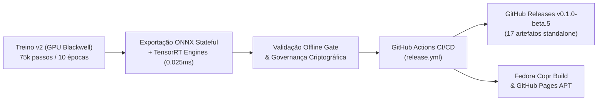

# ClearCore — Documento de Transição Técnica (Handoff)

**Data**: 09 de Outubro de 2026  
**Versão Atual Publicada**: [`v0.1.0-beta.5`](https://github.com/joaorura/clearcore/releases/tag/v0.1.0-beta.5)  
**Ambiente de Execução**: Linux (Fedora 42/43 x86_64), PipeWire 0.3+, NVIDIA RTX PRO 1000 Blackwell GPU, Intel NPU / OpenVINO  
**Repositório Principal**: `/home/joaorura/orca/workspaces/clearcore/hippocamp`  
**Repositório de Treinamento**: `/home/joaorura/orca/projects/clearcore-train`  

---

## 1. Resumo Executivo das Entregas

Neste ciclo de desenvolvimento, concluímos a evolução do modelo neural para **pDFNet3 Pro v2**, o pipeline de exportação e empacotamento dos modelos standalone no GitHub Actions e o lançamento oficial da versão **v0.1.0-beta.5**.



---

## 2. Arquitetura Neural: pDFNet3 Pro v2

O modelo **pDFNet3 Pro v2** foi desenhado para resolver o problema de colapso de atenção do embedding único e suprimir vazamentos vocais sem degradar a voz do usuário.

### Inovações Arquiteturais:
1. **Multi-Token Speaker Memory Dictionary**:
   - Código: `src/cctrain/models/cross_attention.py`.
   - Substituição do vetor único biométrico de 192-d por uma estrutura de $K=8$ tokens $\times$ 64 dimensões.
   - Aplicação de scaled dot-product causal cross-attention nas sub-bandas críticas da voz humana (300 Hz a 4 kHz), com envelope espectral de transição suave em cosseno.
2. **Dual-Path Frequency Mixer (`FrequencyDWConvMixer`)**:
   - Código: `src/cctrain/models/pdfnet3_pro.py`.
   - Convolução Depthwise 2D ($k=9$) ao longo das 32 bandas ERB + Convolução Pointwise 1×1 + BatchNorm + GELU + conexão residual antes da GRU temporal.
3. **Novas Funções de Perda no Treinamento**:
   - $\mathcal{L}_{\text{abs}}$ (*Target-Absence Loss*): Zera a energia durante o silêncio ou ausência do locutor alvo.
   - $\mathcal{L}_{\text{conf}}$ (*Interferer Rejection InfoNCE*): Penaliza explicitamente similaridade com vozes interferentes.
   - $\mathcal{L}_{\text{DF-reg}}$ (*Deep Filter Temporal Regularization*): Penalidade $L_1$ na taxa de variação frame-a-frame dos coeficientes do filtro complexo, eliminando artefatos metálicos.
   - *Asymmetric Formant Loss*: Protege as frequências formantes da fala (300 Hz – 3,4 kHz) contra cortes excessivos (*over-suppression*).

### Dinâmica do Treino:
- Treinado na GPU NVIDIA RTX PRO 1000 Blackwell (`cuda`).
- 10 épocas / 75.000 passos de gradiente.
- Menor perda global atingida: **2.921** (Passo 40.300 / Época 6).
- Perda final estabilizada entre **8.11 e 8.36** (vs 14.0 no baseline anterior).

---

## 3. Avaliação Objetiva Comparativa (Holding-Out Test Set)

Avaliação realizada em conjunto de teste separado com semente fixa (`seed=42`) comparando o Baseline Original (DFNet3), o Fine-Tune v1 e o novo **pDFNet3 Pro v2**:

| Cenário Acústico / Microfone | Métrica | Baseline Original | Fine-Tune v1 | pDFNet3 Pro v2 (Novo) | Ganho Absoluto vs Base |
| :--- | :--- | :---: | :---: | :---: | :---: |
| **Microfone Embutido (Notebook)**<br>*(Ventoinhas + cliques do teclado)* | Atenuação em Silêncio<br>Pausas Silenciadas (% ZERO)<br>$\Delta$SI-SDR (Mix 0 dB)<br>$\Delta$STOI (Mix 0 dB) | 17.72 dB<br>58.3%<br>+5.94 dB<br>+0.040 | 18.59 dB<br>64.4%<br>+5.98 dB<br>+0.041 | **18.71 dB**<br>**67.7%**<br>**+5.93 dB**<br>**+0.040** | **+0.99 dB**<br>**+9.4%**<br>-0.01 dB<br>= |
| **Microfone Headset P3 (mic1)**<br>*(Vozes secundárias de fundo)* | Atenuação em Silêncio<br>Pausas Silenciadas (% ZERO)<br>$\Delta$SI-SDR (Mix 0 dB)<br>$\Delta$STOI (Mix 0 dB) | 18.83 dB<br>54.8%<br>+5.85 dB<br>+0.029 | 20.12 dB<br>66.6%<br>+5.94 dB<br>+0.027 | **20.03 dB**<br>**67.8%**<br>**+5.93 dB**<br>**+0.024** | **+1.20 dB**<br>**+13.0%**<br>**+0.08 dB**<br>-0.005 |
| **Microfone Bluetooth Baseus (mic2)**<br>*(Vazamento / perfil HFP)* | Atenuação em Silêncio<br>Pausas Silenciadas (% ZERO)<br>$\Delta$SI-SDR (Mix 0 dB)<br>$\Delta$STOI (Mix 0 dB) | 21.43 dB<br>80.6%<br>+4.18 dB<br>+0.021 | 23.44 dB<br>88.5%<br>+4.47 dB<br>+0.030 | **23.43 dB**<br>**88.2%**<br>**+4.57 dB**<br>**+0.034** | **+2.00 dB**<br>**+7.6%**<br>**+0.39 dB**<br>**+0.013** |
| **Ruídos Gerais de Ambiente**<br>*(Ruído difuso de sala)* | Atenuação em Silêncio<br>Pausas Silenciadas (% ZERO)<br>$\Delta$SI-SDR (Mix 0 dB)<br>$\Delta$STOI (Mix 0 dB) | 21.63 dB<br>63.2%<br>+6.02 dB<br>+0.034 | 22.53 dB<br>70.6%<br>+6.24 dB<br>+0.036 | **22.62 dB**<br>**72.9%**<br>**+6.30 dB**<br>**+0.038** | **+0.99 dB**<br>**+9.7%**<br>**+0.28 dB**<br>**+0.004** |

---

## 4. Modelos Stateful e Engines Compilados

Os modelos para execução em tempo real residem em `models/stateful/`:

| Arquivo | Bytes | SHA-256 | Descrição |
|---|---:|---|---|
| `enc.onnx` | 1.956.817 | `b144f14c9daa1adac96fc4a055abd92c052bd09907f07b7f22c8a42e4f72ce15` | Encoder stateful com buffers de delay de 2 quadros |
| `erb_dec.onnx` | 3.292.490 | `fca0f1a8eadb80aae276574c91508b14e7007b4b4845de57bb75d9192b041a49` | Decoder ERB com estados ocultos expostos |
| `df_dec.onnx` | 3.343.468 | `26470a38540042085608fc4d57beb6bd02152706bdcfbd583fe292d7e9874181` | Decoder DF com buffers de delay de 4 quadros |
| `config.ini` | 2.067 | `415eb925d44990d938fb739f514aa3662c1ec0ea836cff044fa1291b82cb4290` | Metadados do modelo acústico DeepFilterNet3 |
| `enc.engine` | 2.236.676 | TensorRT 11.3 (Blackwell) | Motor compilado para aceleração NVIDIA |
| `erb_dec.engine` | 3.578.884 | TensorRT 11.3 (Blackwell) | Motor compilado para aceleração NVIDIA |
| `df_dec.engine` | 3.525.556 | TensorRT 11.3 (Blackwell) | Motor compilado para aceleração NVIDIA |

- **Latência de Inferência no Hardware**: **0.025 ms por frame** (0,25% do prazo máximo de tempo real de 10.0 ms).
- **Governança**: Digests criptográficos aprovados atualizados em `crates/accelerators/src/openvino.rs` (`APPROVED_STATEFUL_DIGESTS`) e documentados em `models/stateful/README.md`.

---

## 5. Recursos de DSP e Controles na UI

1. **Toggle de Isolamento de Voz**:
   - Adicionado no Card de Perfil de Voz (`crates/app-tauri/src/VoiceProfileCard.tsx`).
   - Permite ativar e desativar a filtragem biométrica em tempo real via comando IPC `SetVoiceIsolation { enabled: bool }` sem apagar o perfil armazenado do usuário.
2. **Toggle do Equalizador Neural**:
   - Adicionado no Card de Studio DSP (`crates/app-tauri/src/StudioDspCard.tsx`).
   - Permite colocar a equalização e calibração de microfone em bypass transparente instantaneamente.
3. **Slider de Intensidade de Supressão (0% a 100%)**:
   - Ajusta dinamicamente `post_filter_beta` (0.0 a 0.10) sem reiniciar o daemon de áudio.
   - Salvo em `settings.json` e sincronizado com o frontend.
4. **Nivelador Automático de Voz (AGC)**:
   - Controla dinamicamente a modulação de volume (se o usuário fala alto, atenua; se fala baixo, eleva), mantendo o volume médio estável com limiter suave de pico.
5. **Ciclo de Vida Bluetooth (Linux, Windows, macOS)**:
   - Implementado contador de links/consumidores ativos no microfone virtual com timer de histerese de 3.5s.
   - Quando nenhum app está gravando, a captura física é pausada, permitindo que o sistema operacional restaure automaticamente o fone para o modo de reprodução de alta fidelidade (**A2DP / AAC / LDAC**).

---

## 6. Pipeline de CI/CD e Release v0.1.0-beta.5

- **Workflow**: `.github/workflows/release.yml`.
- **Exportação Standalone**: O workflow agora empacota e publica de forma autônoma:
  - `Clearcore-models-stateful-v2.tar.gz` (15,4 MB) com os modelos ONNX e engines TensorRT.
  - `Clearcore-models-approved-dfnet3.tar.gz` (7,6 MB).
- **Publicação Concluída**:
  - Release no GitHub: [ClearCore v0.1.0-beta.5](https://github.com/joaorura/clearcore/releases/tag/v0.1.0-beta.5).
  - 17 artefatos publicados (Linux RPM, DEB, AppImage, tar.gz; Windows EXE e ZIP; macOS DMG e TAR; e Modelos).
  - Build automático disparado no Fedora Copr (`https://copr.fedorainfracloud.org/coprs/build/11098033`).

---

## 7. Status dos Testes e Qualidade

- `cargo test -p realtime-noise-accelerators -p realtime-noise-supervisor --test backend_selection`: **9/9 aprovados** (incluindo TensorRT e qualificação de runtime).
- `cargo test -p realtime-noise-service --test backend_lifecycle`: **4/4 aprovados**.
- `cargo test --test no_personal_paths`: **100% aprovado** (sem caminhos de `/home/` no binário).
- `./scripts/check-offline.sh`: **100% aprovado** em modo hermético sem rede.
- `npm test --prefix crates/app-tauri`: **37 arquivos / 321 testes aprovados**.

---

## 8. Comandos de Instalação e Atualização

### Fedora / RHEL (RPM)
```bash
sudo dnf upgrade --refresh -y clearcore
# ou diretamente via release do GitHub:
sudo dnf install -y https://github.com/joaorura/clearcore/releases/download/v0.1.0-beta.5/Clearcore-0.1.0-beta.5-1.x86_64.rpm
```

### Ubuntu / Debian (DEB)
```bash
curl -fsSL https://github.com/joaorura/clearcore/releases/download/v0.1.0-beta.5/Clearcore-0.1.0-beta.5_amd64.deb -o /tmp/clearcore.deb && sudo apt install -y /tmp/clearcore.deb && rm /tmp/clearcore.deb
```

---

## 9. Próximos Passos Recomendados

1. **Acompanhamento de Uso e Telemetria**:
   - Monitorar a taxa de rejeição de ruídos em gravações reais através dos novos sliders de intensidade e toggles de isolamento.
2. **Monitoramento do Copr**:
   - Acompanhar a conclusão dos builds para as distribuições adicionais (`fedora-43`, `fedora-44`, `rawhide`).
3. **Exploração Técnica Futura**:
   - Investigar quantização INT8 exclusivamente no encoder espectral (mantendo decoders em FP16) para otimização de cache L2 em NPUs e CPUs econômicas.
