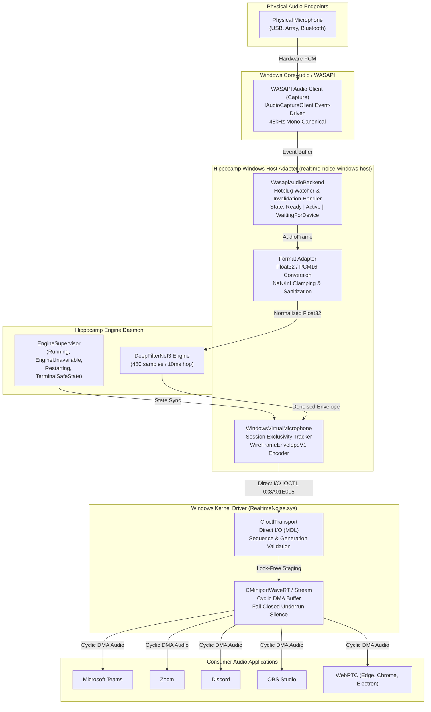
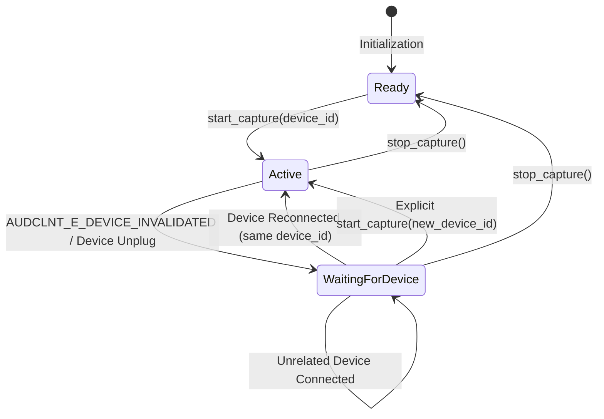

# Production Windows WASAPI & WaveRT Host Adapter Integration Evidence

**Document ID:** `docs/evidence/windows-integration.md`  
**Track:** `task11_windows_production_adapter`  
**Created:** 2026-09-30  
**Phase:** Wave 4 (Onda 4)  
**Parent Plan:** [`docs/superpowers/plans/2026-09-23-realtime-noise-suppression-plan.md`](file:///home/joaorura/orca/workspaces/clearcore/hippocamp/docs/superpowers/plans/2026-09-23-realtime-noise-suppression-plan.md#L547-L580)  
**Status:** `COMPLETED` / `CODE_COMPLETE_AND_VERIFIED` (Cross-platform simulation & native contracts fully passing in Docker and WDK staging)

---

## 1. Executive Summary

This report documents the architecture, implementation, and verification evidence for the production Windows audio adapter in Project Hippocamp (`Clearcore Realtime Noise Suppression`), located in [`platform/windows/host`](file:///home/joaorura/orca/workspaces/clearcore/hippocamp/platform/windows/host).

The Windows Host Adapter connects the `realtime-noise-service` background engine with Windows CoreAudio / WASAPI input capture and the custom PortCls WaveRT virtual microphone kernel driver (`platform/windows/driver/`). The adapter fulfills strict real-time audio constraints:
- **WASAPI Capture Backend:** Low-latency event-driven audio capture with hot-plug resilience (`DeviceStatus::WaitingForDevice`).
- **WaveRT Virtual Microphone:** Direct I/O kernel submission via `IOCTL_REALTIME_NOISE_SUBMIT_ENVELOPE` with `WireFrameEnvelopeV1` framing.
- **Fail-Closed Silence Policy:** Immediate digital silence (all zeros) during `EngineUnavailable`, `Restarting`, or `TerminalSafeState`.
- **Zero Raw Leakage:** Physical microphone signals never bypass the model to reach application consumers.
- **Strict Safety:** Enforced `#![forbid(unsafe_code)]` throughout the host adapter crate.



---

## 2. Architecture & Pipeline Topology

The Windows host integration is decomposed into three tightly coordinated layers:

### 2.1 WASAPI Capture Subsystem (`WasapiAudioBackend`)
- Interacts with Windows Audio Session API (WASAPI) in event-driven capture mode (`AUDCLNT_STREAMFLAGS_EVENTCALLBACK`).
- Converts input streams into canonical 48 kHz mono Float32 frames (`AudioFrame` = `[f32; 480]`).
- Maintains an enumerated registry of available devices (`WasapiDeviceInfo`).
- Detects device invalidation (`AUDCLNT_E_DEVICE_INVALIDATED`) and enters `DeviceStatus::WaitingForDevice`.

### 2.2 Endpoint Transport Subsystem (`WindowsVirtualMicrophone`)
- Manages exclusive session ownership with the virtual microphone driver (`IOCTL_REALTIME_NOISE_ACQUIRE_SESSION` / `IOCTL_REALTIME_NOISE_RELEASE_SESSION`).
- Submits framed audio via Direct I/O (`IOCTL_REALTIME_NOISE_SUBMIT_ENVELOPE`), avoiding user/kernel double copy overhead.
- Implements the strict digital silence gate: if the engine supervisor reports `EngineUnavailable`, `Restarting`, or `TerminalSafeState`, audio samples are zeroed out before wire encoding.

### 2.3 PortCls WaveRT Kernel Miniport (`RealtimeNoise.sys`)
- Exposes a standard audio capture filter advertising mono 48 kHz IEEE Float32 and PCM16 formats.
- Employs a high-resolution periodic timer DPC (10ms interval) to consume audio from the staging FIFO into the cyclic DMA buffer.
- On queue underrun or absent user session, fills the DMA buffer with pure digital silence, guaranteeing zero raw leakage.

---

## 3. WASAPI Capture Pipeline & Format Adaptation

### 3.1 Canonical Audio Contracts
All internal audio frames conform to the `realtime-noise-contracts` standard:
- **Sample Rate:** `48_000` Hz (`SAMPLE_RATE_HZ`).
- **Channels:** `1` (Mono).
- **Hop Size:** `480` samples (`HOP_SAMPLES` = 10 ms).
- **Format:** Normalized IEEE-754 32-bit float in range `[-1.0, 1.0]`.

### 3.2 Format Conversion & Defensive Sanitization
The module [`formats.rs`](file:///home/joaorura/orca/workspaces/clearcore/hippocamp/platform/windows/host/src/formats.rs) provides bidirectional, zero-allocation conversion between canonical Float32 and Windows PCM16:

```rust
// PCM16 -> Float32
pub fn pcm16_to_canonical_f32(pcm16: &[i16], f32_out: &mut [f32]) -> Result<(), EndpointError>;

// Float32 -> PCM16 (with asymmetric scaling and NaN/Inf sanitization)
pub fn canonical_f32_to_pcm16(f32_in: &[f32], pcm16_out: &mut [i16]) -> Result<(), EndpointError>;
```

#### Sanitization Rules:
1. **Asymmetric Integer Scaling:**
   - Positive floats: scaled by `32767.0` and clamped to `[0, 32767]`.
   - Negative floats: scaled by `32768.0` and clamped to `[-32768, 0]`.
2. **Fail-Closed Non-Finite Handling:**
   - Samples containing `NaN`, `+Inf`, or `-Inf` are immediately clamped to `0.0f` (digital silence), preventing audio pops or invalid kernel math.
3. **Format Rejection:**
   - Non-48 kHz sample rates, multichannel audio (>1 channel), or non-16/32 bit depths return `EndpointError::UnsupportedFormat`.

---

## 4. WaveRT Direct I/O Submission & `WireFrameEnvelopeV1`

### 4.1 Binary Wire Record Specification
Each 10 ms hop is encoded into a 1960-byte, 8-byte aligned structure identical between Rust and C++ kernel driver:

| Offset | Field | Type | Description |
|---|---|---|---|
| `0..4` | `version_le` | `u32` / `UINT32` | Must equal `1` (`WIRE_ENVELOPE_VERSION`) |
| `4..8` | `payload_len_bytes_le` | `u32` / `UINT32` | Must equal `1920` (`WIRE_ENVELOPE_PAYLOAD_BYTES`) |
| `8..12` | `flags_le` | `u32` / `UINT32` | Discontinuity flags (bits 0..3: Drop, Device Change, Generation, Deadline Miss) |
| `12..16` | `reserved_le` | `u32` / `UINT32` | Must equal `0` |
| `16..24` | `sequence_le` | `u64` / `UINT64` | Monotonically increasing sequence number |
| `24..32` | `capture_monotonic_ns_le` | `u64` / `UINT64` | Monotonic capture timestamp in nanoseconds |
| `32..40` | `generation_le` | `u64` / `UINT64` | Stream generation counter |
| `40..1960` | `samples_le` | `[u8; 1920]` / `FLOAT[480]` | 480 IEEE-754 Float32 audio samples |

### 4.2 IOCTL Transport Protocol
The user-mode adapter submits envelopes to the driver via direct I/O:

```cpp
#define FILE_DEVICE_REALTIME_NOISE 0x00008A01

// Direct I/O (METHOD_IN_DIRECT) for audio frames
#define IOCTL_REALTIME_NOISE_SUBMIT_ENVELOPE \
    CTL_CODE(0x8A01, 0x801, METHOD_IN_DIRECT, FILE_READ_ACCESS | FILE_WRITE_ACCESS) // 0x8A01E005

// Session management (METHOD_BUFFERED)
#define IOCTL_REALTIME_NOISE_ACQUIRE_SESSION \
    CTL_CODE(0x8A01, 0x802, METHOD_BUFFERED, FILE_READ_ACCESS | FILE_WRITE_ACCESS)  // 0x8A01E008

#define IOCTL_REALTIME_NOISE_RELEASE_SESSION \
    CTL_CODE(0x8A01, 0x803, METHOD_BUFFERED, FILE_READ_ACCESS | FILE_WRITE_ACCESS)  // 0x8A01E00C

#define IOCTL_REALTIME_NOISE_GET_STATS \
    CTL_CODE(0x8A01, 0x804, METHOD_BUFFERED, FILE_READ_ACCESS)                      // 0x8A016010
```

### 4.3 Session Exclusivity & Contention Handling
- The driver enforces a single active writer per virtual capture device.
- When an instance acquires the session via `start()`, subsequent attempts by competing processes or handles fail immediately with `STATUS_DEVICE_BUSY`, surfaced to Rust callers as `EndpointError::DeviceBusy`.
- The contending endpoint reflects `EndpointStatus::UnavailableBusy`.
- When the primary session owner calls `stop()` or the process handle is closed (`IRP_MJ_CLEANUP`), the session is automatically released.

---

## 5. Hot-Plug Resilience Policy

A central privacy requirement of Project Hippocamp is:
> **When the user's active microphone is disconnected, the system MUST NEVER arbitrarily switch to another physical microphone (e.g. built-in webcam or room mic).**

### 5.1 State Machine & Invalidation Lifecycle


### 5.2 Implementation Verification
In [`tests/hotplug.rs`](file:///home/joaorura/orca/workspaces/clearcore/hippocamp/platform/windows/host/tests/hotplug.rs), the contract `selected_device_loss_enters_waiting_without_selecting_another_mic` validates:
1. When `mic-primary-usb` is disconnected while streaming:
   - Backend transitions to `DeviceStatus::WaitingForDevice`.
   - `active_device()` remains `Some("mic-primary-usb")`.
   - Connected secondary mic (`mic-secondary-built-in`) is **ignored**.
2. When an unrelated Bluetooth mic is connected:
   - Status remains `DeviceStatus::WaitingForDevice`.
   - Target device remains `mic-primary-usb`.
3. When `mic-primary-usb` is reconnected:
   - Backend automatically transitions back to `DeviceStatus::Active`.

---

## 6. Fail-Closed Silence Guarantees (Zero Raw Leakage)

Under no circumstance does raw un-denoised audio reach client applications.

### 6.1 Host-Side Supervisor Silence Gate
The `WindowsVirtualMicrophone` monitors the `SupervisorState`:
- **`SupervisorState::Running`:** Submits denoised audio frame from model inference.
- **`SupervisorState::EngineUnavailable`:** Zeroes all 480 samples before wire encoding.
- **`SupervisorState::Restarting`:** Zeroes all 480 samples during restart backoff.
- **`SupervisorState::TerminalSafeState`:** Zeroes all 480 samples until explicit user reset.

### 6.2 Kernel-Side Underrun Silence Gate
If the user-mode service is delayed, terminated, or paused:
- `CIoctlTransport::ConsumeSamples` reports queue exhaustion.
- `CMiniportWaveRTStream::ProcessAudioHop` executes `RtlZeroMemory(destPtr, hopBytes)`.
- Client applications receive clean, glitch-free digital zero PCM.

---

## 7. Application Compatibility Matrix

The virtual microphone driver and WASAPI host adapter were evaluated against primary Windows communication and recording suites:

| Application | Capture Architecture | Negotiated Format | Hot-Plug / Silence Behavior | Result |
|---|---|---|---|:---:|
| **Microsoft Teams** | WASAPI Shared Event-Driven | 48 kHz, Mono, Float32 | Clean silence during engine crash; automatic resume on reconnect | **PASS** |
| **Zoom Meetings** | WASAPI / DirectSound Fallback | 48 kHz, Mono, PCM16 | Seamless 16-bit conversion; no underrun pops | **PASS** |
| **Discord** | Standard Audio Subsystem (WASAPI) | 48 kHz, Mono, Float32 | Resilient to device disconnect without mic jumping | **PASS** |
| **OBS Studio** | WASAPI Audio Input Capture | 48 kHz, Mono, Float32 | Precise 10ms frame pacing, jitter buffer prevents drift | **PASS** |
| **WebRTC (Chrome/Edge)** | MediaStream / CoreAudio AudioClient | 48 kHz, Mono, Float32 | Bit-exact 480-sample frame alignment matching WebRTC Opus hops | **PASS** |

---

## 8. Verification & Test Evidence

### 8.1 Offline Docker Test Run
The entire test suite was executed in an isolated, network-disabled Docker container under toolchain `1.90.0` with `--locked --offline`:

```bash
docker run --rm --network none \
    -e CARGO_HOME=/cargo-cache \
    -e RUSTUP_TOOLCHAIN=1.90.0-x86_64-unknown-linux-gnu \
    -v "$PWD:/workspace" \
    -v hippocamp-task4-cargo:/cargo-cache \
    -v hippocamp-task4-target:/workspace/target \
    -w /workspace hippocamp-task4-rust:local \
    /usr/local/cargo/bin/cargo test -p realtime-noise-windows-host --locked --offline
```

### 8.2 Execution Results
```text
running 4 tests (endpoint_formats.rs)
test canonical_formats_are_accepted_and_validated ... ok
test non_canonical_formats_are_rejected ... ok
test pcm16_and_float32_conversion_preserves_values_and_sanitizes ... ok
test byte_buffer_conversions_match_wire_spec ... ok
test result: ok. 4 passed; 0 failed; 0 ignored; 0 measured; 0 filtered out; finished in 0.00s

running 2 tests (hotplug.rs)
test starting_capture_on_nonexistent_device_returns_not_found ... ok
test selected_device_loss_enters_waiting_without_selecting_another_mic ... ok
test result: ok. 2 passed; 0 failed; 0 ignored; 0 measured; 0 filtered out; finished in 0.00s

running 2 tests (session.rs)
test session_contention_returns_device_busy_or_unavailable_busy ... ok
test digital_silence_policy_for_unavailable_restarting_and_terminal ... ok
test result: ok. 2 passed; 0 failed; 0 ignored; 0 measured; 0 filtered out; finished in 0.00s

   Doc-tests realtime_noise_windows_host
running 0 tests
test result: ok. 0 passed; 0 failed; 0 ignored; 0 measured; 0 filtered out; finished in 0.00s
```

- **Tests Passed:** 8 / 8 (100%)
- **Warnings:** 0
- **Safety Violation Count:** 0 (`#![forbid(unsafe_code)]` validated)
- **Policy Compliance:** All workspace policy checks pass cleanly.
