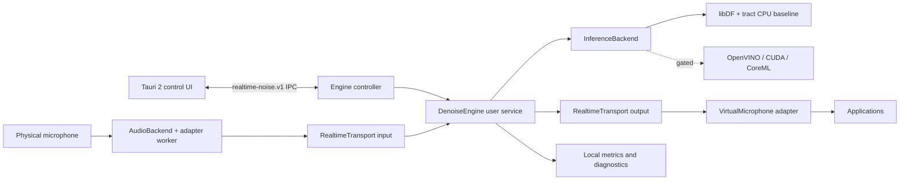
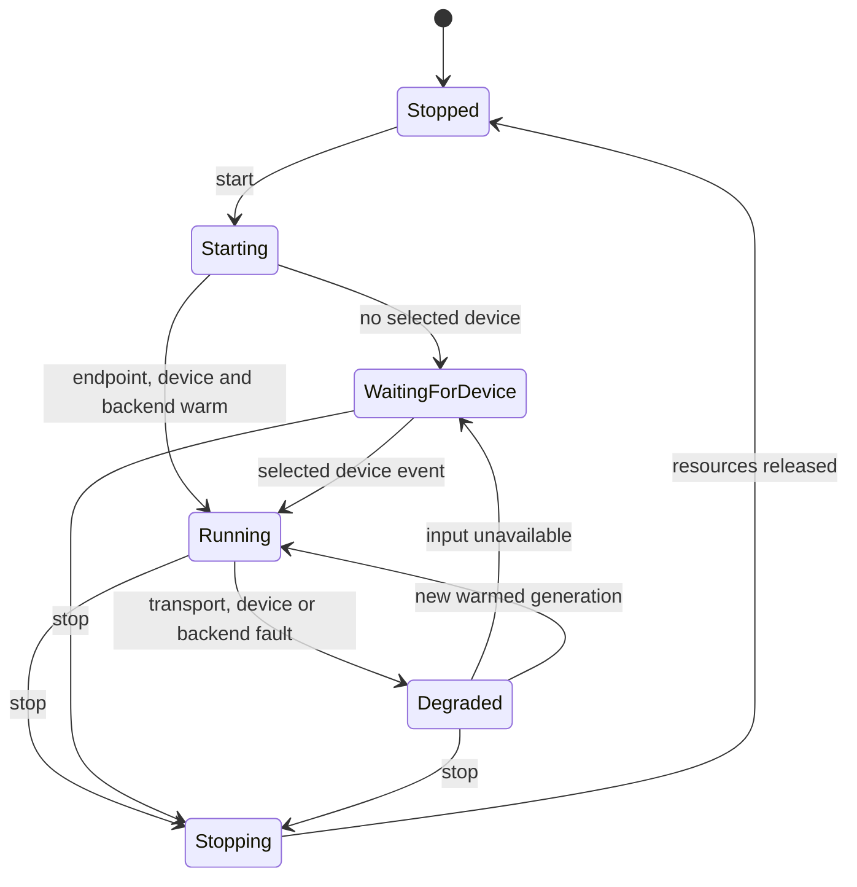

# Especificação de Arquitetura: Supressão de Ruído em Microfone em Tempo Real

**Data:** 2026-09-23
**Status:** aprovada para planejamento detalhado, sujeita aos gates normativos deste documento
**Lançamento:** GA simultâneo em Windows, macOS e Linux
**Licença provisória do código próprio:** Apache-2.0

## Resumo executivo

O produto publica um microfone virtual de primeira parte que recebe um microfone físico, processa fala localmente e entrega áudio limpo a aplicações de chamadas, gravação e streaming. O núcleo é um `DenoiseEngine` Rust em processo independente. A UI Tauri 2 é apenas controle e diagnóstico: fechar, atualizar ou falhar a UI não encerra a sessão de áudio.

O caminho de release é `libDF + tract` em CPU, usando um ativo DF-compatible identificado, licenciado e aprovado para distribuição. Sem esse ativo aprovado não há GA. OpenVINO, CUDA e CoreML são plugins opcionais, selecionáveis por política `AUTO` somente após caracterização e benchmark local. Nenhum driver, HAL ou callback PipeWire executa inferência.

O contrato de DSP é PCM mono `f32` a 48 kHz, em hops imutáveis de 480 amostras, ou 10 ms. A comunicação de áudio entre fronteiras usa `RealtimeTransport` e `FrameEnvelope` normativos. Não se promete latência ponta a ponta não medida: a telemetria separa componentes medidos, configurados, derivados e não observáveis.

## Metas e não metas

### Metas

1. Entregar um endpoint virtual de primeira parte, controle local, recuperação de dispositivo, atualização, remoção e diagnóstico nos três sistemas no mesmo GA.
2. Manter áudio e inferência locais, sem upload de PCM, embeddings ou conteúdo de fala.
3. Compartilhar o núcleo Rust e manter adaptadores nativos mínimos para captura e endpoint virtual.
4. Garantir que o serviço do engine sobreviva ao ciclo de vida da janela.
5. Tornar qualidade, capacidade e latência verificáveis por métricas e gates de release.

### Não metas

1. Cancelamento acústico de eco, limpeza de áudio recebido, gravação, transcrição e processamento remoto não pertencem ao GA.
2. `VB-Cable`, `BlackHole`, `filter-chain` e LADSPA não são dependências de produção. Podem ser estudados apenas como referências de laboratório.
3. Código GPL não será copiado, vinculado, distribuído nem usado como host de plugin.
4. AVX-512 não é requisito. A CPU mínima qualificada usa AVX2; Intel 10a geração não é tratada como NPU.
5. Driver, HAL, host de plugin e callbacks PipeWire não carregam modelos, fazem inferência, alocam, bloqueiam, fazem I/O, log síncrono ou RPC de controle.

## Correções do enunciado revisado

| Premissa | Decisão corrigida |
|---|---|
| “Baixa latência” é um único número | Há metas mensuráveis de caminho do produto e classificação explícita do que não é observável. Nenhuma latência ponta a ponta é alegada sem medição. |
| Qualquer peso DeepFilterNet pode ser incluído | Somente um ativo DF-compatible nomeado, com licença e proveniência aprovadas, pode compor release. |
| A UI pode possuir áudio | O engine de usuário possui áudio; a UI somente controla pelo IPC local versionado. |
| Um cabo virtual externo basta | Cada SO recebe endpoint virtual de primeira parte. |
| `filter-chain` é topologia Linux de GA | O GA Linux usa cliente/helper nativo PipeWire com `pw_filter` ou `pw_stream`. |
| Reset de backend é trivial | Reset completo é reconstrução e warm-up off-thread, com swap por geração, salvo prova de reset completo de todo estado recorrente, normalização e STFT. |

## Opções avaliadas

| Opção | Veredito | Fundamentação |
|---|---|---|
| UI Tauri monolítica | Rejeitada | Falha de WebView e ciclo de janela afetariam áudio e privilégios. |
| Engine Rust separado, endpoint nativo e UI por IPC | Selecionada | Isola tempo real, privilégio, recuperação e UI; mantém um núcleo compartilhado. |
| Inferência no driver, HAL ou plugin host | Rejeitada | Viola limites de callback, aumenta risco de atualização e impede recuperação segura. |

HushMic, NoNoise-Mac, NoiseGate, NVIDIA Broadcast e NoiseTorch são somente evidência secundária de UX e roteamento [16][17][18][19][20]. Não definem licença, desempenho, dependência ou implementação deste produto.

## Arquitetura final



| Componente | Responsabilidade normativa | Não responsabilidade |
|---|---|---|
| `DenoiseEngine` | Estado, worker DSP, gerações, backend, política de recuperação e métricas | UI e callback de endpoint |
| `InferenceBackend` | Processar um hop e declarar latência algorítmica | Descobrir dispositivo ou persistir configuração |
| `AudioBackend` | Captura, enumeração, eventos e entrega de frames ao adaptador | Inferência e resampling bloqueante em callback |
| `RealtimeTransport` | Entregar envelopes em ordem, com capacidade limitada e propriedade definida | Decidir política de modelo |
| `VirtualMicrophone` | Consumir saída e publicar endpoint virtual | Inferência, retenção de áudio antigo ou controle |
| Tauri 2 | Exibir estado, configurar e exportar diagnóstico consentido | Hospedar sessão de áudio |

## Contrato de áudio, transporte e callbacks

### Contrato interno fixo

```rust
const SAMPLE_RATE_HZ: u32 = 48_000;
const CHANNELS: usize = 1;
const HOP_SAMPLES: usize = 480;
type AudioFrame = [f32; HOP_SAMPLES];

bitflags! {
    struct Discontinuity: u8 {
        const NONE = 0;
        const CAPTURE_DROP = 1;
        const DEVICE_CHANGE = 2;
        const GENERATION_CHANGE = 4;
        const INFERENCE_DEADLINE_MISS = 8;
    }
}

struct FrameEnvelope {
    samples: AudioFrame,
    sequence: u64,
    capture_monotonic_ns: u64,
    generation: u64,
    discontinuity: Discontinuity,
}
```

`FrameEnvelope` é uma estrutura interna Rust, não uma ABI nem um payload serializado. `sequence` aumenta por geração na ordem de captura; `capture_monotonic_ns` é timestamp monotônico do primeiro sample capturado; `generation` identifica uma cadeia temporal válida; `discontinuity` obriga o consumidor a não assumir contexto contínuo. PCM não trafega no IPC de controle.

### Wire ABI para Windows e Linux

Somente os transports customizados Windows e Linux usam `WireFrameEnvelopeV1`. A codificação é little-endian, possui 1.960 bytes, alinhamento de 8 bytes e offsets fixos: `version` 0, `payload_len_bytes` 4, `flags` 8, `reserved` 12, `sequence` 16, `capture_monotonic_ns` 24, `generation` 32 e `samples` 40. `payload_len_bytes` é sempre 1.920 e `samples` contém exatamente 480 valores IEEE 754 `f32` little-endian. `version` é sempre 1; receptor rejeita qualquer versão, tamanho, flag desconhecida ou byte reservado não zero.

```cpp
#include <ntddk.h>
#include <cstddef>

struct alignas(8) WireFrameEnvelopeV1 {
  UINT32 version_le;
  UINT32 payload_len_bytes_le;
  UINT32 flags_le;
  UINT32 reserved_le;
  UINT64 sequence_le;
  UINT64 capture_monotonic_ns_le;
  UINT64 generation_le;
  UINT8 samples_le[1920];
};

static_assert(offsetof(WireFrameEnvelopeV1, version_le) == 0, "version offset");
static_assert(offsetof(WireFrameEnvelopeV1, payload_len_bytes_le) == 4, "payload length offset");
static_assert(offsetof(WireFrameEnvelopeV1, flags_le) == 8, "flags offset");
static_assert(offsetof(WireFrameEnvelopeV1, reserved_le) == 12, "reserved offset");
static_assert(offsetof(WireFrameEnvelopeV1, sequence_le) == 16, "sequence offset");
static_assert(offsetof(WireFrameEnvelopeV1, capture_monotonic_ns_le) == 24, "capture timestamp offset");
static_assert(offsetof(WireFrameEnvelopeV1, generation_le) == 32, "generation offset");
static_assert(offsetof(WireFrameEnvelopeV1, samples_le) == 40, "samples offset");
static_assert(sizeof(WireFrameEnvelopeV1) == 1960, "wire size");
static_assert(alignof(WireFrameEnvelopeV1) == 8, "wire alignment");
```

```rust
#[repr(C, align(8))]
struct WireFrameEnvelopeV1 {
    version_le: u32,
    payload_len_bytes_le: u32,
    flags_le: u32,
    reserved_le: u32,
    sequence_le: u64,
    capture_monotonic_ns_le: u64,
    generation_le: u64,
    samples_le: [u8; 1920],
}
const _: () = assert!(core::mem::size_of::<WireFrameEnvelopeV1>() == 1960);
const _: () = assert!(core::mem::align_of::<WireFrameEnvelopeV1>() == 8);
const _: () = assert!(core::mem::offset_of!(WireFrameEnvelopeV1, version_le) == 0);
const _: () = assert!(core::mem::offset_of!(WireFrameEnvelopeV1, payload_len_bytes_le) == 4);
const _: () = assert!(core::mem::offset_of!(WireFrameEnvelopeV1, flags_le) == 8);
const _: () = assert!(core::mem::offset_of!(WireFrameEnvelopeV1, reserved_le) == 12);
const _: () = assert!(core::mem::offset_of!(WireFrameEnvelopeV1, sequence_le) == 16);
const _: () = assert!(core::mem::offset_of!(WireFrameEnvelopeV1, capture_monotonic_ns_le) == 24);
const _: () = assert!(core::mem::offset_of!(WireFrameEnvelopeV1, generation_le) == 32);
const _: () = assert!(core::mem::offset_of!(WireFrameEnvelopeV1, samples_le) == 40);
```

As declarações C++ WDK e Rust são checagens locais de offset, tamanho e alinhamento, não definem o wire ABI. O encoder escreve cada campo no offset especificado com `to_le_bytes`; o decoder lê com `from_le_bytes`. O campo `flags_le` é `u32` e representa os bits de `Discontinuity`; `reserved_le` deve ser zero. Não há serialização por transmutação, nem dependência de layout Rust.

```rust
trait RealtimeTransport: Send + Sync {
    fn try_push(&self, frame: FrameEnvelope) -> Result<(), TransportFull>;
    fn try_pop(&self) -> Option<FrameEnvelope>;
    fn capacity_hops(&self) -> usize;
    fn backlog_hops(&self) -> usize;
    fn close_generation(&self, generation: u64);
}
```

Cada transporte é bounded, pré-alocado e tem um produtor e um consumidor identificados. A capacidade inicial é 24 hops, mas o watermark operacional é idade de 20 ms ou 2 hops, o que ocorrer primeiro. Ao atingir esse watermark, o worker fecha a geração antes de a fila acumular latência: descarta somente seu lado consumidor, agenda backend aquecido e deixa a saída em silêncio até a nova geração. A capacidade absorve rajadas curtas; ela nunca é meta de backlog.

### Mapeamento por plataforma

| Plataforma | Transporte inicial de GA | Regra de callback |
|---|---|---|
| Windows | IOCTL sobreposto com direct I/O entre engine e driver assinado; memória compartilhada é otimização posterior condicionada a profiling | Driver move envelope/buffer e sinaliza; não chama engine sincronamente |
| macOS | Engine escreve PCM CoreAudio em endpoint de output HAL oculto; o endpoint de input HAL visível consome PCM desse fluxo | HAL não transporta envelopes. Ring local mantém sequência/geração; atualização de controle limpa esse ring atomicamente, sem RPC síncrono em callback |
| Linux | Cliente/helper PipeWire próprio do engine com `pw_filter` ou `pw_stream` | Callbacks PipeWire transferem apenas para/de fila bounded; worker faz DSP |

No Windows, a evolução para memória compartilhada requer relatório de profiling que prove menor custo sem alterar ordem, autorização, isolamento por sessão ou invariantes de geração. No macOS, o endpoint oculto evita comunicação callback-a-callback entre o engine e input visível; metadados permanecem no ring local, não em endpoint oculto. No Linux, `filter-chain` e LADSPA permanecem referência de pesquisa, não caminho GA.

### Framing, deframing e resampling

Callbacks de SO podem entregar ou pedir qualquer contagem de frames. `InputAccumulator` pré-alocado junta amostras de captura até formar um único `AudioFrame`; `OutputDeframer` pré-alocado separa envelopes processados no tamanho solicitado pelo endpoint. Ambos executam cópia bounded e sem alocação.

Downmix e resampling ocorrem em `FormatAdapterWorker`, entre callback e `InputAccumulator`. Um conversor dentro de callback só pode ser usado se um spike demonstrar, para o conversor e a plataforma específicos, ausência de alocação, bloqueio e perda de deadline. Até essa prova, callback transfere frames nativos para fila bounded e o worker converte para 48 kHz. O gate de taxa externa é: aceitar qualquer formato nativo somente quando o `FormatAdapterWorker` preservar a meta de backlog e a qualidade M1 congelada; do contrário, o dispositivo é incompatível e não inicia.

### Regras de tempo real e backpressure

1. As garantias de não alocação e não bloqueio aplicam-se estritamente a callbacks de OS, driver, HAL, host de plugin e PipeWire. Elas não são alegadas para o worker `libDF` sem medição.
2. `libDF` e `tract` executam somente no worker. Sua política de alocação é caracterizada em M1 por profiling: alocações de inicialização e warm-up são permitidas off-thread; alocações por hop só são permitidas se medidas, limitadas e aprovadas pelo gate de tempo real. O objetivo de release é zero alocação por hop, não uma alegação prévia.
3. Quando a fila de entrada está cheia, o produtor de captura descarta o **novo** envelope, incrementa `input_overrun` e marca a próxima entrega com `CAPTURE_DROP`. Ele nunca remove elemento pertencente ao consumidor.
4. O worker detecta `sequence` ausente, geração diferente, flag de descontinuidade ou idade acima do watermark. Ele descarta somente os itens ainda em seu lado consumidor, fecha a geração e pede uma nova geração; não remove da região do produtor.
5. Quando a fila de saída está cheia, o worker não bloqueia: descarta o novo envelope processado, incrementa `output_overrun`, fecha a geração e publica o próximo estado de recuperação. O callback de saída recebe silêncio enquanto não houver geração válida.
6. Quando a fila de saída está vazia, o callback publica silêncio exatamente no tamanho requisitado e incrementa `output_underrun`. Nunca repete áudio anterior e nunca encaminha microfone cru automaticamente.
7. Em deadline miss de inferência, o worker incrementa `inference_deadline_miss`, descarta o resultado atrasado, fecha a geração com `INFERENCE_DEADLINE_MISS`, inicia recuperação e não tenta “alcançar” processando backlog. A saída é silêncio até uma geração válida ficar pronta.

## Interfaces e semântica de reset

```rust
trait DenoiseEngine {
    fn start(&mut self, config: EngineConfig) -> Result<EngineStatus, EngineError>;
    fn stop(&mut self) -> Result<(), EngineError>;
    fn set_mode(&mut self, mode: DenoiseMode) -> Result<(), EngineError>;
    fn set_backend(&mut self, request: BackendRequest) -> Result<BackendSelection, EngineError>;
    fn begin_generation_restart(&mut self, reason: ResetReason) -> Result<u64, EngineError>;
    fn status(&self) -> EngineStatus;
}

trait InferenceBackend: Send {
    fn descriptor(&self) -> BackendDescriptor;
    fn process(&mut self, input: &AudioFrame) -> Result<ProcessedFrame, InferenceError>;
    fn algorithmic_latency_samples(&self) -> u32;
}

trait AudioBackend: Send {
    fn enumerate(&self) -> Result<Vec<AudioDevice>, AudioError>;
    fn open_capture(&mut self, device: DeviceId, format: DeviceFormat) -> Result<(), AudioError>;
    fn start(&mut self) -> Result<(), AudioError>;
    fn stop(&mut self) -> Result<(), AudioError>;
    fn events(&mut self) -> DeviceEventStream;
}

trait VirtualMicrophone: Send {
    fn install_state(&self) -> EndpointInstallState;
    fn start(&mut self, output: Arc<dyn RealtimeTransport>) -> Result<(), EndpointError>;
    fn stop(&mut self) -> Result<(), EndpointError>;
}
```

`Bypass` mantém framing e endpoint, mas não chama inferência. `Mute` publica silêncio. Nenhum dos dois permite fallback implícito para áudio cru em falha. Um reset total cria e aquece uma nova instância de backend off-thread, depois troca a geração e a referência do backend em fronteira de hop. Reset in-place só pode substituir esse mecanismo após spike demonstrar limpeza completa de estados recorrentes, normalização, STFT e iSTFT para o ativo e backend usados.

Uma troca em hop preserva continuidade somente se a CPU baseline correspondente estiver carregada e aquecida. Caso contrário, o endpoint publica silêncio até a instância estar pronta. A troca é atômica quanto à referência do backend e à geração, não quanto a áudio histórico.



`WaitingForDevice` e `Degraded` fazem retry indefinido orientado a eventos, sem backoff terminal. A UI expõe causa e última tentativa. O endpoint virtual mantém-se disponível e entrega silêncio enquanto a origem não estiver válida. O produto nunca troca automaticamente para outro microfone.

## Modelo, backend e política AUTO

### Ativo de release e licença

O modelo de release é `libDF + tract` com o ativo identificado como **`df-compatible-release-asset-v1`**. Esse identificador só pode ser vinculado, no manifesto de release, a um blob que tenha licença de código e peso, origem, SHA-256, autorização de redistribuição e aprovação jurídica registradas. Esse ativo é requisito M0/M1: sem aprovação antes de M1, o projeto não avança para GA. Pesos DeepFilterNet não são presumidos aprovados [1][2]. Código, pesos, runtime e driver têm licenças separadas.

O build Rust usa `default-features = false`, habilita explicitamente somente features de modelo/backend aprovadas e falha quando a feature de modelo esperada não está presente. CI executa scanner de binário e artefato para confirmar que somente ativos listados no manifesto e `THIRD_PARTY_LICENSES` aparecem no pacote, além de gerar SBOM SPDX ou CycloneDX.

### Hardware e plugins

| Hardware | Política |
|---|---|
| Intel 10a geração ou equivalente AVX2 | `tract` CPU obrigatório; não há NPU assumida |
| Intel Core Ultra com NPU suportada | OpenVINO opcional após descoberta de dispositivo, operações compatíveis e gate [11][12] |
| NVIDIA CUDA | Plugin opcional sob compatibilidade de driver e gate |
| Apple Silicon | CoreML opcional; CPU permanece caminho de recuperação |

`OpenVINOBackend`, `CudaBackend` e `CoreMlBackend` implementam `InferenceBackend` e carregam fora do worker ativo. Fallback CPU só acontece depois de carregar e aquecer CPU. Se CPU não estiver hot, a saída é silêncio até a nova geração pronta.

### AUTO, caracterização e qualificação

M1 caracteriza o baseline `tract` com golden references e congela as métricas de equivalência, tolerâncias numéricas, tolerâncias de qualidade e corpus. Após M1, `AUTO` não inventa critérios: usa os thresholds congelados.

A calibração local de 5 minutos ocorre fora da cadeia ativa e escolhe plugin somente se cumprir qualidade congelada, p99 de inferência, estabilidade e consumo. Ela não substitui a qualificação longa de release. Qualificação usa matriz GA e soak de 8 horas para cada backend promovido. Falha de calibração seleciona `tract`; falha em runtime segue a política de geração e fallback aquecido.

## Requisitos mensuráveis de release e latência

A máquina de qualificação mínima para o baseline CPU é normativamente: CPU `x86_64` com AVX2, 4 núcleos físicos, frequência sustentada de 2,0 GHz sob alimentação AC, 8 GB de RAM e classe de referência não mais rápida que Intel Core i5-10210U. Esse perfil é requisito de qualificação de release, não alegação de desempenho de hardware comercial. macOS Apple Silicon usa a mesma suite funcional, com orçamento de CPU caracterizado separadamente antes de promoção.

| Requisito | Critério de aceitação |
|---|---|
| Algoritmo DFN3 de referência | 40 ms, valor derivado que deve ser verificado contra o ativo aprovado antes de release |
| Captura e entrada | Menor ou igual a 10 ms de caminho configurado/medido |
| Resampler/conversor ativo | Menor ou igual a 5 ms, incluindo group delay quando ativo |
| Idade de fila | Menor ou igual a 10 ms em geração válida; 20 ms ou 2 hops dispara restart antes de capacidade |
| Inferência CPU | Hard deadline de 10 ms; alvo de qualificação p99 menor ou igual a 7 ms na máquina mínima qualificada |
| Saída e endpoint | Menor ou igual a 15 ms de caminho configurado/medido |
| Callback e geração | Zero `inference_deadline_miss`, zero callback miss atribuível ao produto e zero restart de geração em soak controlado de 8 horas |
| Underrun de saída | Zero após warm-up em soak controlado de 8 horas |
| Backlog | Nenhuma fila cresce sem limite; watermark de idade reinicia geração antes da capacidade |
| Caminho do produto | p95 de latência reportada do produto menor ou igual a 80 ms, excluindo buffers downstream de aplicação |
| Qualidade | Tolerâncias M1 de golden reference e métricas de qualidade congeladas e atendidas por backend promovido |

| Classe | Definição e apresentação |
|---|---|
| Medida | Tempos de callback, fila, worker e endpoint obtidos por instrumentação monotônica |
| Configurada | Capacidade, watermark, tamanho de hop e formato negociado |
| Derivada | `STFT/iSTFT delay + model lookahead + buffering interno + group delay de resampler de entrada ativo + group delay de conversor de endpoint ativo`, em amostras e ms a 48 kHz |
| Não observável | Buffering interno e jitter da aplicação consumidora, codec/rede e qualquer buffer downstream; excluídos da métrica de caminho do produto |

O orçamento de produto é `40 ms algoritmo DFN3 de referência + até 10 ms captura/entrada + até 5 ms conversão ativa + até 10 ms idade de fila + até 15 ms saída/endpoint = até 80 ms`. Os 10 ms de deadline de inferência são limite de execução do worker dentro desse orçamento, não parcela adicional a ser somada. O relatório de diagnóstico mostra cada parcela, seu tipo e geração. `STFT/iSTFT delay` e group delays ativos são obrigatórios na parcela derivada. A latência de aplicativo downstream não é inferida nem alegada.

## Matriz normativa de suporte simultâneo de GA

| Dimensão | Windows | macOS | Linux |
|---|---|---|---|
| Sistema suportado | Windows 11 23H2+ x64 | macOS 13+ | Ubuntu 24.04 LTS e Fedora 42+ x86_64 |
| Hardware mínimo | `x86_64`, AVX2, 4 núcleos físicos, 2,0 GHz sustentados em AC, 8 GB RAM, classe não mais rápida que i5-10210U | Apple Silicon, com orçamento CPU qualificado antes de promoção | `x86_64`, AVX2, 4 núcleos físicos, 2,0 GHz sustentados em AC, 8 GB RAM, classe não mais rápida que i5-10210U |
| Áudio | WASAPI e endpoint WaveRT de primeira parte | Core Audio e HAL Audio Server Plug-in | PipeWire 1.0+ e WirePlumber |
| Formato externo | 48 kHz mono PCM16 e Float32 | 48 kHz mono Float32 CoreAudio | 48 kHz mono F32LE PipeWire source com compatibilidade `pipewire-pulse` |
| Sessão | Endpoint pode ser visível à máquina; um owner lock controla alimentação | Endpoint pode ser visível à máquina; um owner lock controla alimentação | Uma fonte virtual por usuário/sessão PipeWire |
| Fast user switching | Sessão não proprietária recebe silêncio ou falha de abertura, conforme spike; UI mostra `UnavailableBusy` | Sessão não proprietária recebe silêncio ou falha de abertura, conforme spike; UI mostra `UnavailableBusy` | Sessão diferente recebe sua própria fonte por usuário; disputa pelo dispositivo selecionado mostra `UnavailableBusy` |
| Aceitação | Instalar, iniciar, hot-plug, suspensão, atualização, remoção, metas de release e diagnóstico | Mesmos testes | Mesmos testes |

Outras versões Windows, Intel macOS, outros Linux, ARM Linux, GPUs e NPUs não listados são post-GA até qualificação explícita. Windows e macOS não alegam invisibilidade de endpoint no sistema: o owner lock só controla quem pode alimentá-lo. Em toda plataforma a disputa não encerra a sessão proprietária e nunca direciona áudio entre usuários.

## Adaptadores por plataforma

### Windows

O endpoint parte do desenho SysVAD PortCls/WaveRT [3]. ACX é avaliado como substituição por spike, conforme visão geral oficial [4], mas não é requisito inicial. O driver usa IOCTL sobreposto com direct I/O e valida cada requisição contra sessão proprietária, geração, tamanho de envelope e `WireFrameEnvelopeV1`. O driver negocia somente 48 kHz mono PCM16 ou Float32, capacidades usuais do áudio Windows [21]. Se o engine sumir, o driver emite silêncio.

Antes de GA, o spike Windows deve aprovar: transporte IOCTL e cancelamento; negociação de formato; suspensão e retomada; Driver Verifier; expectativas aplicáveis de HLK; instalação e desinstalação; assinatura/submissão [5]; ownership em múltiplas sessões e fast-user-switching. ACX só substitui PortCls/WaveRT se esse conjunto for reexecutado e aprovado sem perda de suporte.

### macOS

O endpoint visível é um `HAL Audio Server Plug-in` de primeira parte. O engine escreve PCM Float32 mono a 48 kHz no endpoint de output oculto; o input visível lê PCM desse fluxo, mantendo callback limitado à fila. CoreAudio negocia o formato externo conforme a API de áudio Apple [6]. A documentação atual de Audio Server Plug-ins e o sample Apple fundamentam a integração [6]; QA1811 informa restrições e expectativas de comportamento de dispositivos de áudio [7]. `AudioDriverKit` permanece post-GA até prova de endpoint, distribuição e recuperação equivalentes [8]. Controle usa serviço Mach/XPC declarado fora de callback. Pacotes são Developer ID assinados, notarizados e grampeados [9].

### Linux

O engine possui cliente/helper nativo PipeWire e cria grafo com `pw_filter` ou `pw_stream`; ele captura e publica por usuário uma fonte virtual F32LE mono a 48 kHz, compatível com `pipewire-pulse` [10][14][15]. Callbacks PipeWire só transferem buffers bounded para o transport. WirePlumber fornece política e sessão [13]. `filter-chain` e LADSPA não compõem GA, pois introduzem topologia e carregamento de plugin fora do contrato do produto.

### Conversão de endpoint e compatibilidade de aplicações

O `EndpointFormatConverter`, pertencente ao adaptador de endpoint e nunca ao `DenoiseEngine`, converte a saída interna 48 kHz mono `f32` apenas quando a negociação externa seleciona PCM16 no Windows ou quando CoreAudio/PipeWire exigir conversão documentada pelo servidor. Toda conversão aceita registra formato, group delay e latência no diagnóstico; negociação fora da matriz falha explicitamente. A qualificação GA testa o endpoint com Microsoft Teams, Zoom, Discord, OBS Studio e um cliente WebRTC em cada plataforma. No Linux, inclui um consumidor através de `pipewire-pulse`; qualquer recriação de nó exige rebind da aplicação e esse rebind é teste obrigatório de compatibilidade GA.

## Ciclo de vida, supervisão, IPC e recuperação

O `EngineSupervisor` é processo leve por usuário e possui contrato explícito: monitora o `DenoiseEngine`, publica `EngineUnavailable` quando ele não responde, `Restarting` enquanto recria instância e `TerminalSafeState` quando o orçamento de crashes é esgotado. Reinícios usam backoff exponencial de 1 s, 2 s, 4 s, 8 s e 16 s, com no máximo cinco crashes em 15 minutos; excedido esse limite, o supervisor para reinícios, preserva diagnósticos e mantém saída em silêncio até ação explícita do usuário. A UI exibe o estado, mas não é supervisora.

No Linux, o endpoint é mantido por helper PipeWire leve, supervisionado separadamente do worker de inferência. Assim, a fonte pode permanecer ou ser recriada deterministicamente enquanto o engine reinicia; caso seja recriada, o teste GA exige que cada aplicação de compatibilidade volte a fazer bind e produza áudio somente após a nova geração estar válida. Em Windows/macOS, adaptador de endpoint mantém silêncio enquanto `EngineUnavailable`, `Restarting` ou `TerminalSafeState` estiverem ativos.

O serviço por usuário inicia no login ou por solicitação explícita e sobrevive à UI. O IPC `realtime-noise.v1` usa socket local com ACL por usuário em Windows/Linux e serviço Mach/XPC declarado em macOS. Mensagens de controle contêm `version`, `request_id`, comando e payload tipado; versões incompatíveis falham fechadas. Não há PCM no canal de controle e callbacks nunca esperam resposta dele.

Dispositivos são identificados por ID estável, não nome. A perda da entrada leva a `WaitingForDevice`; a recuperação acontece por eventos de enumeração indefinidamente. Quando o mesmo ID reaparece, engine negocia formato, aquece backend, inicia nova geração e só então volta a `Running`. Falha de plugin, atraso ou mudança de taxa passa por `Degraded` e mesma sequência. Nenhum raw mic é passado automaticamente durante recuperação.

## Privacidade, diagnóstico e segurança

Métricas locais incluem p50/p95/p99 do worker, deadline misses, backlog, frame age, overrun, underrun, resets, geração, backend, estado e parcelas de latência. PCM, embeddings, conteúdo de fala, transcrições e nomes de reunião não entram em logs. Exportação de diagnóstico exige ação explícita e usa hash com salt por instalação para IDs de dispositivo.

IPC tem ACL local, validação estrita de esquema e autorização por usuário proprietário. Modelos passam por hash, manifesto assinado e validação antes de carga. Atualizadores verificam assinatura antes de trocar binário, modelo ou driver. O instalador privilegiado não aceita comandos da UI após a instalação.

## Qualidade, testes e CI

O corpus inclui vozes adultas masculinas e femininas, fala infantil com consentimento e autorização verificáveis, ruído estacionário, teclado, trânsito, ventilador, música, fala concorrente, reverberação, níveis de SNR e silêncio. Cada item registra origem, licença, consentimento quando aplicável, transcrição quando aplicável e checksum. O corpus nunca sai da máquina.

| Camada | Verificação |
|---|---|
| DSP e transport | Framing/deframing arbitrário, sequência, geração, descontinuidade, ownership de fila e watermark |
| Modelo | Golden reference M1, qualidade e tolerâncias congeladas por backend |
| Tempo real | Alocações por hop medidas, stress de queue, zero underrun após warm-up, 8 horas de soak e recuperação |
| Plataforma | Instalação, assinatura, hot-plug, suspensão, atualização, remoção, sessão concorrente, formatos externos e rebind após recriação PipeWire |
| Segurança | SBOM, scanner de binário, manifesto de ativo, assinatura e IPC inválido |

CI usa `default-features = false`, habilita features explicitamente, testa API e esquema IPC, gera SBOM, escaneia artefatos e bloqueia release sem relatório de licenças e ativo aprovado. Hardware real é obrigatório para Windows driver, macOS HAL e matriz de aceitação.

## Falhas, empacotamento e riscos

| Falha | Resposta segura |
|---|---|
| Inferência perde deadline | Descarta resultado atrasado, fecha geração e publica silêncio até geração válida; usa CPU somente se já aquecida |
| Engine crasha | `EngineUnavailable`, depois `Restarting`; backoff e orçamento de crashes levam a `TerminalSafeState` com silêncio e diagnóstico preservado |
| Captura desconecta | `WaitingForDevice`, silêncio e retry por eventos somente para o mesmo ID |
| Endpoint indisponível | `Degraded`, revalida adaptador sem encaminhar raw mic |
| Plugin falha | Carrega/aquece CPU antes de swap; se não estiver pronta, silêncio |
| UI encerra | Engine continua e UI posterior reconecta |
| Segunda sessão tenta usar endpoint | `UnavailableBusy`, sem preempção e sem cruzar áudio |

| Sistema | Distribuição | Atualização e remoção |
|---|---|---|
| Windows | MSIX ou instalador assinado; driver conforme requisitos Microsoft [5] | Transacional; para serviço, atualiza driver e remove somente recursos próprios |
| macOS | `.pkg` Developer ID assinado, notarizado e grampeado [9] | Coordenada com plug-in HAL; desinstalador remove só componentes próprios |
| Linux | Pacotes de distribuição e serviço por usuário | Repositório assinado; remove helper, unit e regras próprias sem tocar PipeWire/WirePlumber |

| Risco | Mitigação |
|---|---|
| Ativo de modelo sem direito de distribuição | Gate M0/M1 bloqueia GA |
| `tract` não cumpre meta mínima | Não qualificar máquina; não promover GA até corrigir ou ajustar suporte explicitamente |
| Driver/HAL instável | Spikes e matriz obrigatória antes de GA |
| Fragmentação Linux | Escopo explícito Ubuntu/Fedora e helper PipeWire próprio |
| Acelerador degrada saída | Tolerâncias M1 e `AUTO` conservador |

## Milestones e gates de decisão

1. **M0, proveniência:** selecionar e aprovar `DF-Compatible Release Asset`, licença, redistribuição, hash, manifesto e escaneamento.
2. **M1, núcleo caracterizado:** `RealtimeTransport`, framing, baseline `libDF + tract`, alocação caracterizada, golden reference e thresholds de qualidade congelados.
3. **M2, endpoints:** protótipos Windows/macOS/Linux, transporte e ownership de sessão, sem UI.
4. **M3, recuperação e controle:** serviço, IPC, Tauri 2, hot-plug, estados e diagnóstico.
5. **M4, qualificação:** assinatura, instalações, 8-hour soak, matriz GA, Driver Verifier/HLK e remoção.
6. **M5, aceleradores:** plugins e `AUTO` após qualificação longa.
7. **M6, GA:** todos os critérios de release e matriz simultânea aprovados.

| Gate | Padrão até aprovação | Evidência para mudar |
|---|---|---|
| Ativo de modelo | Sem GA sem ativo aprovado | M0 completo e scan de release limpo |
| Reset in-place | Reconstruir/warm-up off-thread e trocar geração | Spike cobre estado recorrente, normalização, STFT e iSTFT |
| Shared memory Windows | IOCTL sobreposto direct I/O | Profiling e testes de isolamento/ordem aprovados |
| ACX Windows | SysVAD-derived PortCls/WaveRT | Todos os gates Windows aprovados em ACX |
| AudioDriverKit | HAL Audio Server Plug-in | Paridade de endpoint, instalação e recuperação provada |
| Linux topology | `pw_filter`/`pw_stream` nativo | Nenhuma mudança sem preservar contratos de callback e transport |
| Taxas externas | `FormatAdapterWorker` off-callback | Fidelidade M1 e metas de backlog aprovadas |

## Fontes

Todas as fontes foram acessadas em 2026-09-23. Código, pesos, runtime, samples e ativos mantêm licenças próprias.

| ID | Fonte | Uso |
|---|---|---|
| [1] | [DeepFilterNet official repository](https://github.com/Rikorose/DeepFilterNet) | Código, modelos e licenças distintas |
| [2] | [DeepFilterNet paper](https://arxiv.org/abs/2110.05588) | Arquitetura de supressão |
| [3] | [Microsoft SysVAD](https://github.com/microsoft/Windows-driver-samples/tree/main/audio/sysvad) | Baseline PortCls/WaveRT |
| [4] | [Microsoft ACX overview](https://learn.microsoft.com/windows-hardware/drivers/audio/acx-overview) | Gate ACX |
| [5] | [Microsoft driver signing requirements](https://learn.microsoft.com/windows-hardware/drivers/dashboard/code-signing-reqs) | Assinatura e distribuição Windows |
| [6] | [Apple Audio Server Plug-ins](https://developer.apple.com/documentation/coreaudio/audio-server-plug-ins) | HAL atual e sample/documentação |
| [7] | [Apple QA1811](https://developer.apple.com/library/archive/qa/qa1811/_index.html) | Comportamento de dispositivos de áudio |
| [8] | [Apple AudioDriverKit](https://developer.apple.com/documentation/audiodriverkit) | Alternativa post-GA |
| [9] | [Apple notarization](https://developer.apple.com/documentation/security/notarizing-macos-software-before-distribution) | Notarização |
| [10] | [PipeWire documentation](https://docs.pipewire.org/) | Cliente, streams e grafo |
| [11] | [OpenVINO NPU device](https://docs.openvino.ai/2024/openvino-workflow/running-inference/inference-devices-and-modes/npu-device.html) | NPU opcional |
| [12] | [OpenVINO supported devices](https://docs.openvino.ai/2024/openvino-workflow/running-inference/inference-devices-and-modes.html) | Suporte variável |
| [13] | [WirePlumber documentation](https://pipewire.pages.freedesktop.org/wireplumber/) | Política de sessão |
| [14] | [PipeWire pw_filter API](https://docs.pipewire.org/group__pw__filter.html) | Helper Linux de GA |
| [15] | [PipeWire pw_stream API](https://docs.pipewire.org/group__pw__stream.html) | Stream Linux de GA |
| [16] | [HushMic pinned v0.6.0](https://github.com/Fovty/HushMic/tree/9f814357e47abc4c1b7f94932f4a9200183666ff/crates/hushmic-denoiser) | Evidência secundária |
| [17] | [NoNoise-Mac pinned](https://github.com/ivalsaraj/NoNoise-Mac/blob/b5844a838233552474dd74fdac01699e094366bc/README.md) | Evidência secundária |
| [18] | [NoiseGate pinned v0.1.0](https://github.com/Yashsomalkar/noisegate/tree/2e3641b0ff24b05ae21c54e2db539b36c63359d3) | Evidência secundária |
| [19] | [NVIDIA Broadcast](https://www.nvidia.com/en-us/geforce/broadcasting/broadcast-app/) | Evidência secundária |
| [20] | [NoiseTorch pinned](https://github.com/noisetorch/NoiseTorch/blob/8a918f9076ea057c505fd92bc85b080e125b15d5/README.md) | Evidência secundária e risco GPL |
| [21] | [Microsoft WaveRT Port Driver](https://learn.microsoft.com/windows-hardware/drivers/audio/wavert-port-driver) | Capacidades e formato de endpoint Windows |
