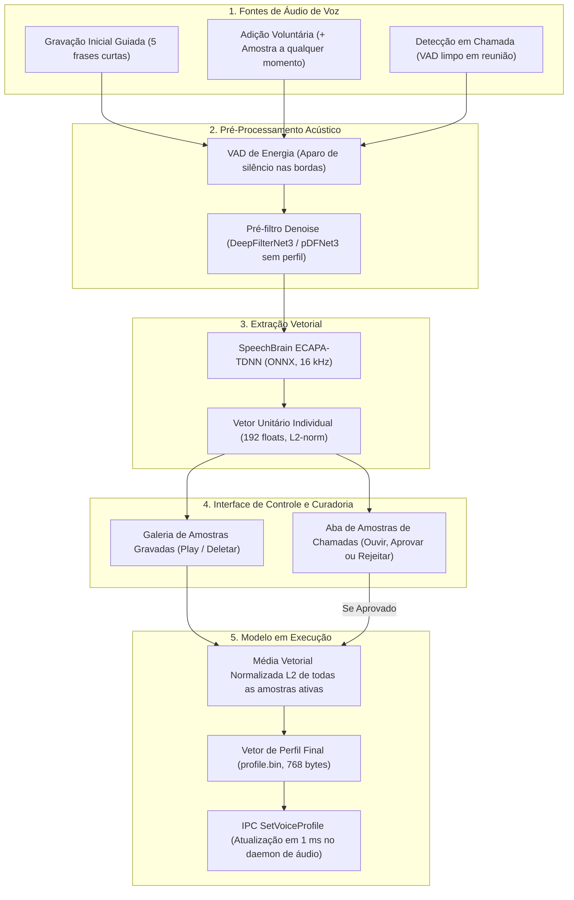

# Spec: Sistema de Enrollment Contínuo, Multi-Amostragem e Curadoria de Perfil de Voz

**Data:** 2026-10-04  
**Status:** APROVADO PELO PRODUTO  
**Workspace:** `Clearcore (hippocamp)` / `clearcore-train`  
**Autor:** Antigravity / Decisões do Usuário

---

## 1. Visão Geral e Motivação

O isolamento de voz do usuário no Clearcore (`pDFNet3`) depende de um vetor de características acústicas (embedding de 192 dimensões extraído pelo SpeechBrain ECAPA-TDNN).
O método tradicional de gravação estática única (um áudio contínuo de 20-30 segundos) apresenta sérias deficiências no mundo real:
1. É cansativo e monótono para o usuário na primeira instalação.
2. Não captura a variabilidade acústica cotidiana (mudança de postura, cansaço vocal, troca de headsets, acústica de salas diferentes).
3. Adaptações automáticas em segundo plano ("caixa-preta") trazem o risco de contaminar o perfil caso outra pessoa fale no microfone durante uma reunião.

Esta especificação define a arquitetura oficial do subsistema de cadastro e gerenciamento de perfil de voz do Clearcore, baseada em **Multi-Amostragem Guiada**, **Galeria Cumulativa de Amostras**, **Curadoria Transparente de Capturas em Chamada** e **Pré-filtragem com Redução de Ruído**.

---

## 2. Pilares de Arquitetura

---

## 3. Especificação Funcional

### 3.1. Cadastro Inicial: Multi-Amostragem Guiada com Perguntas Abertas
- **Formato:** 5 áudios independentes de **4 a 6 segundos cada** (total de 20 a 30 segundos).
- **Gamificação visual:** Barra de progresso dinâmica (`1/5` a `5/5`) com medidor de energia vocal.
- **Abordagem de Fala Espontânea (Perguntas Abertas):** Em vez de leitura mecânica de textos, a interface exibe perguntas cotidianas que forçam a fala natural, cadência real de reunião e expressividade:
  1. *Início de Reunião (Conversacional):* *"Como você costuma dar bom dia e perguntar se todos estão te ouvindo quando entra em uma chamada?"*
  2. *Rotina Matinal (Espontâneo / Descontraído):* *"O que você comeu ou bebeu hoje de manhã logo após acordar?"*
  3. *Foco de Trabalho (Projeção / Profissional):* *"Qual é a principal tarefa ou projeto em que você está trabalhando hoje?"*
  4. *Espaço de Trabalho (Fricativas e Articulação):* *"Como você prefere organizar sua mesa, monitores e espaço para render bem?"*
  5. *Lazer / Descontração (Pitch e Dinâmica Aberta):* *"Se pudesse viajar para qualquer lugar no próximo fim de semana, para onde você iria?"*
- **Fallback de Leitura:** Para usuários com pressa ou sem criatividade, a UI disponibiliza a opção *"Prefiro ler uma frase curta"*.
- **Critério de Desbloqueio:** Concluídas as 5 amostras válidas, o botão **"Ativar Microfone Personalizado"** é liberado.

### 3.2. Galeria Cumulativa de Amostras (Expansão Livre)
- O usuário não fica preso às 5 amostras iniciais. A qualquer momento na tela de configurações de áudio, ele pode clicar em **`+ Adicionar Amostra de Voz`**.
- Casos de uso ideais:
  - *"Troquei de headset / fone bluetooth"*.
  - *"Estou trabalhando na sala de estar hoje"*.
  - *"Voz mais baixa/noturna"*.
- O usuário pode manter 6, 8, 12 ou mais amostras. Cada uma é armazenada localmente com data/hora e pode ser reproduzida ou excluída a qualquer momento.

### 3.3. Módulo de Monitoramento de Voz em Tempo Real (Voice Intake Engine)
- **Operação no Daemon de Áudio (Rust):** O `realtime-noise-service` possui um módulo passivo de monitoramento (`VoiceIntakeEngine`) que escuta o fluxo do microfone durante chamadas e reuniões ativas.
- **Gatilho de Captura Inteligente de Takes:**
  - VAD de alta confiança detecta fala ativa contínua por 4 a 6 segundos.
  - SNR elevado (fala limpa e audível) e ausência de voz concorrente simultânea.
  - O intake grava o "take" em buffer circular local.
- **Curadoria Transparente na UI (Anti-Caixa Preta):**
  - O take capturado gera um card na aba **"Sugestões Recentes de Chamadas"**.
  - O vetor NÃO é incorporado silenciosamente ao perfil sem a ciência do usuário.
  - O usuário pode:
    - ▶️ **Ouvir:** Reproduzir o áudio exato capturado na chamada.
    - ⭐ **Aprovar / Incorporar:** Adiciona o take à galeria oficial de amostras ativas, recalculando a média vetorial em 1 ms.
    - 🗑️ **Rejeitar / Descartar:** Joga fora o áudio e o embedding correspondente na hora (ideal se houve tosse, interrupção ou voz de terceiro), mantendo o perfil blindado contra contaminações.

### 3.4. Pré-Filtro de Denoise Obrigatório
- Todo áudio de enrollment (seja na gravação inicial, adição voluntária ou captura em reunião) passa obrigatoriamente por:
  1. **VAD de energia:** remoção de silêncio e chiado nas pontas (margem de 40 ms).
  2. **Denoise prévio:** passagem pelo estágio base do DeepFilterNet3 para remover ruídos estacionários (ventiladores, ar-condicionado, teclado) antes do SpeechBrain ECAPA.
- Isso entrega ao extrator de voz uma representação pura dos harmônicos laríngeos e do trato vocal.

### 3.5. Matemática de Combinação e Hot-Swap
- Para um conjunto de $N$ amostras ativas com embeddings unitários $\mathbf{e}_1, \dots, \mathbf{e}_N \in \mathbb{R}^{192}$:
  $$\mathbf{e}_{\text{perfil}} = \frac{\sum_{i=1}^N \mathbf{e}_i}{\left\|\sum_{i=1}^N \mathbf{e}_i\right\|_2}$$
- **Latência de Recálculo:** $< 1$ milissegundo.
- **Atualização no Daemon:** O frontend envia comando IPC `SetVoiceProfile(bytes)` ao `realtime-noise-service`. O supervisor substitui o ponteiro do vetor atômico em memória sem reiniciar o pipeline de áudio (zero glitch / zero estalo).

---

## 4. Rastreabilidade com o Treinamento (clearcore-train)

- **Ablação AB1:** A decisão de treinar com $p_{\text{enroll\_denoise}} = 0,5$ no Estágio F valida que o modelo `pDFNet3` é imune a resíduos de filtragem prévia no enrollment.
- **Ablação AB2:** A calibração de $p_{\text{drop}} \in \{0,1; 0,2; 0,3\}$ em execução na Tarefa T7 determina a sensibilidade ótima entre o modo com perfil e sem perfil.
- **Compatibilidade:** O arquivo gerado continua sendo o `profile.bin` de 768 bytes, mantendo 100% de paridade com o formato binário dos gates G0 a G11 de `gates-v2.yaml`.
